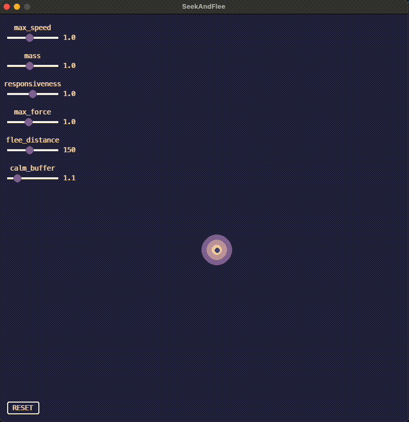
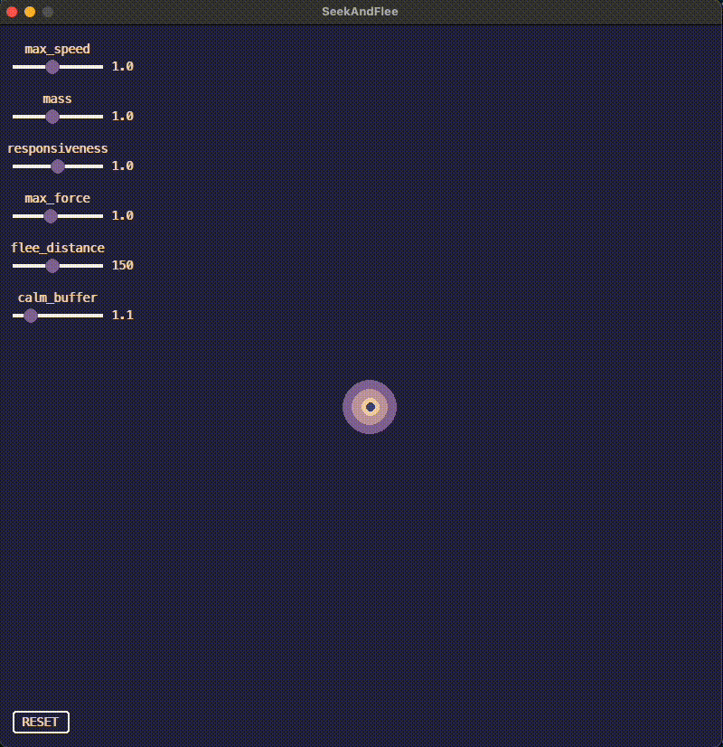
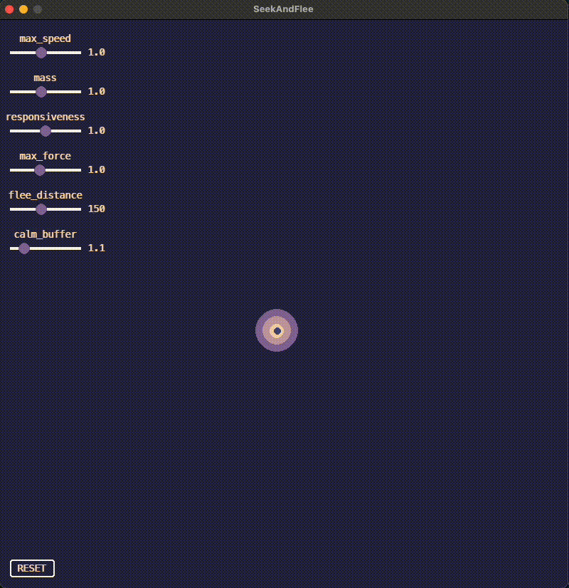

# Seek and Flee Using Pygame
This is an interactive simulation that is intended to illustrate the principles of vehicular movement that were laid out in Craig Reynolds's 1999 paper *["Steering Behaviors for Autonomous Characters"](https://www.red3d.com/cwr/steer/gdc99/)*. More specifically, *this project only examines seek/flee behavior*. I am writing this README in a manner that will allow you to use it as a reference alongside the source code and the running simulation. It is built using the pygame library. So you will need that to be installed in whatever environment you're using.

I enjoy using pygame for agent-based simulations because it has a low level of abstraction but still provides quick feedback and interactivity through the game loop. So I can practice reasoning about state and behavior changes while the logic is not being buried behind physics engine functions or triple-A game development tools.
 When I began investigating Reynolds-steering for a fish pond simulation that I am building, I didn’t come across any resources that exactly fit what I needed from a learning tool. The Coding Train channel on YouTube has a [great series](https://www.youtube.com/watch?v=p1Ws1ZhG36g&list=PLRqwX-V7Uu6ZV4yEcW3uDwOgGXKUUsPOM&index=39) that works straight from the original Reynolds paper... but he works in JavaScript. Other YouTube creators I found have some very informative projects utilizing pygame vector movement... but they aren't Reynolds-based. So I figured I would write this README for anybody out there who is like me and might find this information useful. ***Thanks for checking this out :)***

Reynolds-steering relies on the concept of a "vehicle" with a defined set of attributes. While the full explanation of these attributes can be found in the paper, the core behavior that emerges can be elicited via the implementation of three ideas...

1. determine a desired velocity  
2. subtract the current velocity from the desired velocity  
3. use the world’s physics to limit the change in velocity per frame  

In this context, a *velocity* is one movement step over a single increment of simulation time. In this project it is a `pygame.Vector2`. It is comprised of a **direction** and a **magnitude**. Apply this *velocity* to the vehicle’s current position, and the result is the vehicle moving in the defined **direction** by the defined **magnitude** to its new position.

All Reynolds-steering behavior involves determining some point in space as the **target**. That point is then used to derive the *desired velocity*. Imagine the vehicle thinking, *"I want to be **here**, **now**."*\
The **direction** and **magnitude** that comprise the *desired velocity* are simple:\
The **direction** points from the current position to the **target**.\
The **magnitude** is how far away the **target** is. \
If you allow the vehicle to apply the *desired velocity* directly to its current position, it would snap to the **target** on the next frame. But that's not realistic. Natural-looking behavior needs physics.

Different categories of behavior emerge through the combination of...

- *your rules for determining the desired velocity and...*  
- *how your world-defined physics allow the vehicle to move in the simulation space.*

For **seeking behavior**, the *desired velocity* is whatever the vehicle is seeking.  
For **fleeing**, the *desired velocity* is always both...

- far away and...  
- directly opposite whatever is being fled.

\
(Diagram from *["Steering Behaviors for Autonomous Characters"](https://www.red3d.com/cwr/steer/gdc99/)*, Craig Reynolds, 1999)


In this simulation, the vehicle's **target** is always the mouse location. The relationship between *desired velocity* and the **target** depends upon the mode: 

*Seek it* or *Flee it*  

The physics governing how the vehicle achieves its *desired velocity* are always the same. *The only thing that ever changes is the response to the **target**.* But combining them is enough to give an impression of a vehicle *seeking* or *fleeing* the mouse location.

The goal of this simulation is to give you sliders that can manipulate values used in the movement physics. This allows real-time exploration of each parameter’s effect on seek/flee movement behavior within the Reynolds-steering paradigm. Below, I explain...

- [how to operate the simulation...](#simulation-interface-and-controls)  
- [how the parameters function at a few conceptual layers and...  ](#contextualizing-the-parameters)
- [some different parameter settings that emulate familiar movement patterns.](#movement-patterns-you-may-recognize)


## Simulation Interface and Controls

***Assumptions: Python and pygame are both installed and running in your environment*** 

Getting the simulation to start should be as simple as executing the script in seek_and_flee.py \
A display window housing the now-active simulation should begin immediately.\
You can exit the simulation by clicking the red X at the top left of the window or by pressing 'q'.

### Default Interface

The three colored circles are the **Seekers**. Each of them has a different "mass" attribute at instantiation that is associated with its radius - smaller is lighter and bigger is heavier. *Top speed will always be consistent across all three **Seekers**. So differences in behavior between them are effects of physics being applied to different mass values.*

Your mouse is the smallest circle on the screen. By default, it is a slightly lighter color than the background. The color of this circle is the indicator for what mode the **Seekers** are in. By default, they are seeking. So every frame they try to converge on the location of the mouse.

#### -- Toggle the **Seekers** between *seek* and *flee* by clicking the mouse --
(see below)



A mouse click switches the **Seeker** mode from *seek* to *flee*. This mode is indicated by the mouse switching to white. The **Seekers** now flee from the mouse anytime it gets too close. When the mouse is out of range, the **Seekers** go to the center of the screen.

### Sliders

The sliders on the left of the screen are what really make this simulation instructive. \
*(and were by far the most difficult part of writing this sim since they are the first UI features I have ever written)*

They alter modifiers to the values used in the frame-by-frame movement physics. So if you were curious how the **Seekers** behavior would change if you...
- doubled the top speed they could achieve...
- reduced their mass by half...
- increased the distance at which they began fleeing...
- *whatever combination you want to try...*

...you can take a look at it. 
And, of course, the **RESET** button at the bottom left **restores all slider values to their respective default.**




In the next section, I will get into more granular detail about what the values of the sliders actually mean. If you don't care about more detail, that's totally fine. Play around with the sliders and observe the change in behavior. [***But you may be interested in the last section of this README.***](#movement-patterns-you-may-recognize) In that section I group together some parameter settings to show how certain combinations can emulate movement patterns that you may recognize.

If you ***are*** interested in the nitty-gritty, please proceed.

# Contextualizing the Parameters

The goal for this section is to effectively communicate the workings of the source code such that you can begin to ***predictively*** manipulate the slider values. Currently, they are unit-less. What does a slider value of 1.5 even mean? I am going to try and guide you to the answer.

Remembering the big picture, I said that Reynolds-steering behavior will emerge if you implement these three ideas:
1. determine a desired velocity --> *seek* or *flee*  
2. subtract the current velocity from the desired velocity --> derive the *steering force* 
3. use the world’s physics to limit the change in velocity per frame --> apply *current constraints* to steering  

## 1. determine a desired velocity
Explaining what the slider values actually represent begins here.

Source code line 22, the `modifiers` dict uses slider names for keys and stores their associated values. So anytime you move a slider to a new value, the change occurs at `modifiers[slider_name]`.

Two of the sliders are trivial to explain:\
`flee_distance` and `calm_buffer`

They can be found in the `else:` block starting on line 548 of the source code:
```python
    else:
        for seeker in self.seekers:
            (
                effective_max_speed,
                effective_max_force,
                slowing_distance,
            ) = self._recalculate_effective_values(seeker)
            flee_distance = modifiers["flee_distance"]
            calm_distance = (
                flee_distance 
                * modifiers["calm_buffer"]
            )
```
They are only relevant when `mode == Mode.FLEE`. The `flee_distance` literally corresponds to a pixel amount. I could have included units for this one but decided not to for the sake of consistency. A slider value of 150 means that, when the center of the **Seeker** is less than or equal to 150 pixels from the **target**, it will trigger `SeekerState.FLEEING`. That **Seeker** will then try to move *far* and *directly away* from the **target**. But it can't run forever and remain natural-looking. It needs to switch back to `SeekerState.RETURNING`. At some point, an entity will decide it has fled far enough and calm itself. That's the `calm_buffer`. It is a simple scalar to `flee_distance`. A precise label for purpose of `calm_buffer` would be that it introduces a **hysteresis** - a physical science term describing a **separation between conditional state thresholds**. I'll explain the significance of that in a little while. For now, the main point is that both `flee_distance` and `calm_buffer` directly affect the *desired_velocity* of a **Seeker**. But once that *desired_velocity* is determined, we move on to...

## 2. subtract the current_velocity from the desired_velocity

I translated this idea into Python via my `_apply_steering()` method on line 670 of the source code:
```python    
def _apply_steering(
        self, 
        seeker, 
        desired_velocity, 
        effective_max_force, 
        effective_max_speed
    ):
    """Use a desired_velocity and physics constraints to increment position"""

    steering_force = desired_velocity - seeker.velocity
    if abs(steering_force.length()) > effective_max_force:
        steering_force.scale_to_length(effective_max_force)
    seeker.velocity += steering_force
    if abs(seeker.velocity.length()) > effective_max_speed:
        seeker.velocity.scale_to_length(effective_max_speed)
    seeker.x_pos += seeker.velocity.x
    seeker.y_pos += seeker.velocity.y
``` 

If you asked me why this simulation should be described as "Reynolds-based", I would point to this `_apply_steering()` method.

To briefly translate this method to pseudo-code, it would read:

*Determine a vector to apply to the seeker's (x, y) position on this frame by combining its current momentum with the momentum the seeker wants.*
```python 
steering_force = desired_velocity - current_velocity
```
*Use the seeker's inertia to constrain how much change in velocity a seeker may experience on a single frame.*
```python 
if abs(steering_force.length()) > effective_max_force:
    steering_force.scale_to_length(effective_max_force)
```
*Use the seeker's maximum speed to limit the distance it may cover on a single frame.*
```python
if abs(seeker.velocity.length()) > effective_max_speed:
    seeker.velocity.scale_to_length(effective_max_speed)
```
*Use this constrained velocity to increment the seeker's (x, y) position.*
```python
seeker.x_pos += seeker.velocity.x
seeker.y_pos += seeker.velocity.y
```
There is another step I need to take to fully explain the remaining sliders. `_apply_steering()` is intended to be simply a steering calculator. Feed it values and it will alter a **Seeker's** position through a Reynolds-compliant process. This keeps the code block conceptually-contained, debuggable, and modular. But this method isn't directly affected by moving a slider to a new value. It actually just takes updated derived values (`effective_max_force` & `effective_max_speed`). Where do those values come from? What does the slider *actually touch?*

## 3. use the world’s physics to limit the change in velocity per frame
The four remaining non-trivial sliders can be found in `_recalculate_effective_values()` on line 624 of the source code:
```python
def _recalculate_effective_values(self, seeker):
    """Recalculate values that need current GLOBALs"""

    effective_max_speed = seeker.max_speed * modifiers["max_speed"]
    effective_mass = seeker.mass * modifiers["mass"]
    response_time = effective_mass / modifiers["responsiveness"]
    effective_max_force = (
        (effective_max_speed / response_time) 
        * modifiers["max_force"]
    )
    slowing_distance = (
        (effective_max_speed ** 2) 
        / (effective_max_force * 2)
    )
    return (effective_max_speed, effective_max_force, slowing_distance)
```
If `_apply_steering()` is simply meant to be a steering calculator that takes in derived values, then `_recalculate_effective_values()` is the up-to-date viewer of world state that can feed the calculator the correct values.\
More precisely, this method reads `modifiers[slider_name]` values to perform kinematic operations that derive frame-current limitations on the steering behavior that `_apply_steering()` executes.

The main kinematic calculation going on here is ***Stopping Distance Under Constant Acceleration***, typically written as:
```
d = v² / (2a)
```
This determines the distance needed to complete **linear deceleration** for a given velocity and maximum acceleration. Which in my code looks like...
```python
    slowing_distance = (
        (effective_max_speed ** 2) 
        / (effective_max_force * 2)
    )
```
You may have noticed that the above `_apply_steering()` method made no use of `slowing_distance` at all. That's because `slowing_distance` is only crucial for **arrival behavior**. You could still have a Reynolds-based movement system without it, but the behavior has no way of decelerating. So it appears to be entirely frictionless. If you want the behavior to be recognizably *seeking* or *fleeing*, you need to be able to slow it down.\
Slowing it down to a natural-looking stop requires taking into account the `effective_max_speed` at which a **Seeker** may be moving and the `effective_max_force` that may be applied to the **Seeker's** velocity on any single frame.
```python
    response_time = effective_mass / modifiers["responsiveness"]
    effective_max_force = (
        (effective_max_speed / response_time) 
        * modifiers["max_force"]
    )
```
This is the core of what the sliders are affecting. And it is where I will need to do some explaining to justify the separation of these concepts into distinct sliders.

`max_speed` and `mass` are fairly simple scalars to the initial attributes of the **Seeker** to give `effective_max_speed` and `effective_mass`. 

For a **Seeker** to slow in a natural-looking manner, the **Seeker's** inertia, relative to its `effective_mass`, must be accounted for. The amount of time a **Seeker** takes to overcome its mass is inversely affected by `responsiveness`. A larger `responsiveness` value means `effective_mass` is overcome more quickly. This gives a lower `response_time` for this particular **Seeker**. *Each `response_time` value will vary across the three **Seekers** according to their respective masses*.

`effective_max_force` does not vary between the **Seekers**. It is the maximum allowed change in velocity in any single frame. It can be directly scaled by `max_force`. Think of this as a per-frame limitation imposed on the **Seekers** by their world.

*"I don't care how sluggish or nimble each of you may be. **No one** changes their velocity more than **this value** on this frame."*


If you stuck with me, you now have all the necessary context to answer a question like:\
"What does a mass slider value of 0.6 mean?"\
"What happens when I decrease responsiveness?"\
"What will a calm_buffer of 1.0 do?"

But to package it all up in one place and connect us back to "Reynolds-movement" as the motivating concept for this project, I will run through each slider once more and tell you...

# What does this thing do?... (in the vocabulary of Reynolds)
## **max_speed - 1.0 (default)**
Moving this slider to a new value has the effect of multiplying the max_speed attribute of each **Seeker**. Since **Seekers** start with the same max_speed and the scalar is applied consistently, all **Seekers** have the potential to reach the same max_speed, if given enough time. \
***1.0 --> 1.5*** \
This means the original max_speed of **12** get multiplied by **1.5** to yield a new max_speed of **18**.

#### ***Reynolds summary*** - A larger slider value increases the maximum linear distance the **Seeker** can cover on a single frame towards its *desired velocity*

## **mass - 1.0 (default)**
Moving this slider is similar to max_speed. It scales the mass attribute of each **Seeker**. Unlike, max_speed, each **Seeker** has a unique mass. They scale the same but their absolute values will never overlap.\
***1.0 --> 1.5***\
This means the mass attribute for each **Seeker** gets multiplied by **1.5**, ratio between individual **Seeker** mass values is preserved. 

#### ***Reynolds summary*** -  Larger mass values increase the inertia a **Seeker** carries into the next frame. It means the baseline ability of **Seekers** to respond to a new *desired velocity* gets slower. Top speed is not affected, it just takes longer to reach.

## **responsiveness - 1.0 (default)**
Moving this slider inversely scales a **Seeker's** mass value to affect the response time.\
***1.0 --> 1.5***\
For a **Seeker** with mass=**100**, response time goes from **100** to **~66.66**. Responsiveness values above **1.0** decrease response time, values below **1.0** increase response time.

#### ***Reynolds summary*** - Larger responsiveness values decrease the amount of time it takes to resolve differences in current velocity and *desired velocity*. The separation between the effects of mass and responsiveness can best be seen in turning behaviors. A high responsiveness can tighten turning radii for larger mass **Seekers** at higher speeds. Since the equation using responsiveness also uses mass, the behavior scales among the three **Seekers** according to their mass.

## **max_force - 1.0 (default)**
Moving this slider scales the world-maximum allowed change in velocity that any **Seeker** can experience on a single frame. \
***1.0 --> 1.5***\
This change adds a further **50%** to the maximum allowed magnitude of the steering force that gets directly applied to the **Seeker's** new velocity on this frame.

#### ***Reynolds summary*** - If the responsiveness affects how quickly a **Seeker** may overcome its inertia in trying to reach its *desired velocity*, max force caps the degree to which the any individual **Seeker** may demonstrate that ability. I have explained that some sliders are consistent across **Seekers** and some scale the ratio of their masses. Max force does not care about any individual **Seeker** attribute. Think of it as this simulation's light-speed. Lower max force values mean accelerations become drawn out, stopping distances have to increase drastically because deceleration forces are capped, turning radii are large even if your mass is small.

## **flee_distance - 150 (default)**
Moving this slider changes the distance at which **Seekers** will exhibit *fleeing* behavior.\
***150 --> 200***\
This change adds **50** pixels so the **Seekers** will begin *fleeing* the **target** at a distance of **200** pixels.

#### ***Reynolds summary*** - This slider directly controls the range at which the **Seeker's** *desired velocity* changes when the simulation is in flee mode.

## **calm_buffer - 1.1 (default)**
Moving this slider scales the flee distance and sets that value as the calm distance. The difference between the flee distance and the calm distance is the **hysteresis** that I mentioned further up in the README.\
***1.1 --> 1.6***\
This changes the calm distance from **165** to **240**. At **1.1**, when the **Seeker** first enters its fleeing state, it must achieve a distance of at least **165** pixels from the **target** before switching back to its returning state (i.e. seeking the center of the screen). At **1.6**, the **Seeker** must now go an extra **75** pixels away from the **target** before switching state back to returning.

#### ***Reynolds summary*** - This slider controls how far the **Seeker** must travel from the **target**  between changes in *desired velocity* while the simulation is in flee mode. Its effect can quickly be internalized by first setting the slider to its minimum (1.0). This means the flee distance and calm distance are the same. Put the simulation in flee mode, allow the **Seekers** to settle at the center of the screen, and slowly move the **target** towards them. You should see the **Seekers** begin to jitter as their *desired velocity* switches with every other step. Move the slider to the max setting and see the difference.

Now that you have the full code-specific, Reynolds-oriented understanding of what the sliders control, I would like to show you some clusters of setting combinations that produce some recognizable movement patterns in the last section of this README.

# Movement Patterns You May Recognize

A brief disclaimer: \
This is not a physics engine or any sort of professional tool. The movement styles I describe below are at-best rough approximations of the way real motion works. But if you are building movement into one of your projects, these examples might give you some ideas about how to tune initial parameters.

The first cluster of settings I am going to show produce what is probably my favorite result. 
### Inertia-dominated movement 
Think outer space, large spacecraft that cannot use friction to slow themselves. Very floaty, deliberate movement that is incapable of quick reactions.
- high mass
- keep responsiveness low
- max_force at its minimum 


In order to stop at their destination, **Seekers** need to begin slowing extremely early and glide gently to a stop.


To contrast this...
### Maximum G Force
Very precise, snappy, robotic movement. Like a racing drone. 
- low mass
- max responsiveness
- max_force all the way



**Seekers** are glued to the **target** in *seek* mode if you allow them the max_speed. Movements feel decisive and surgical.

Dropping the max_force after trying this one really illustrates the conceptual difference between the sources of responsiveness and max_force. The light **Seekers** can re-orient their direction quickly but the capped force limit just makes them take longer to accelerate. But I'll leave that one for you to check out.\
I would also encourage anyone to take this code and play around with the `SLIDER_LUTS`. I didn't spend a ton of time coming up with ranges or intervals for them. Extend the ranges and see what happens.\
Poke around with the arrival behavior. It's currently linear. But the Maximum G Force cluster would benefit even more from an exponential relationship between distance and deceleration.

Anyways, if you made it this far I just want to say thanks and happy coding!